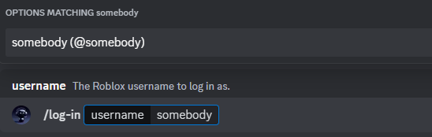
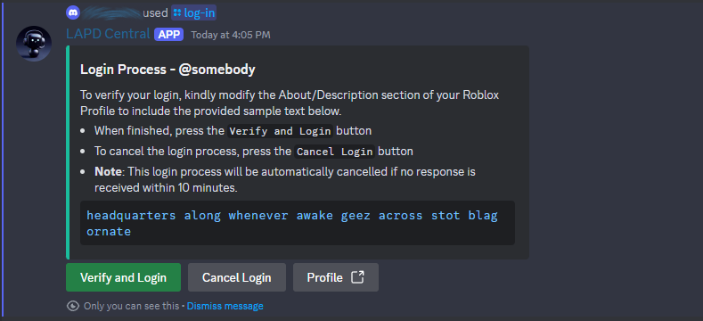
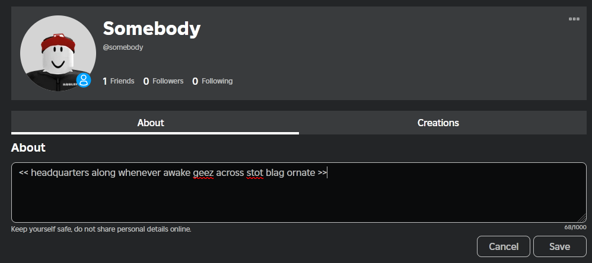
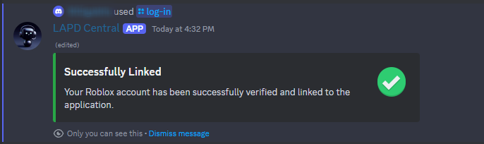

# Linking Roblox Account

Linking a Roblox account makes it easier for both the application and user to execute certain commands which require the Roblox ID, username, and/or display name such as logging an arrest with `/log arrest` slash command. This is a summarized guide on how the linking being done via the application without any third-parties.

## 1. Executing the Login Command

First, you need to execute the login or `/log-in` slash command on the server you are going to be using the application on (in any channel). You will need the Roblox username for the account you will link.

<figure><figcaption>
Executing the slash command
</figcaption></figure>

<figure><figcaption>
The login prompt
</figcaption></figure>

## 2. Modifying Profile Description to Include the Sample Text

As seen above, a prompt will show up when executing the command, asking you to copy and paste the mentioned sample text into your Roblox profile's About and save it. To make it easier to navigate, click (or press) on the `Profile` button to go directly to the Roblox account profile you're linking.

<figure><figcaption>
Modifying the about section of the Roblox profile
</figcaption></figure>


It is not required to completely replace your current profile description but only include the sample text in it. Once you include it and save changes, you may move to the [third step](linking-roblox-account.md#id-3.-verifying-and-linking-the-account) described below.



If Roblox filtered the sample text and made changes to it, such as removing characters and replacing them with hashtags (#), you will need to rerun the command to get another sample text for verification.


## 3. Verifying and Linking the Account

After saving the Roblox profile changes, you click or press on the `Verify and Login` green button on the prompt message. The prompt will subsequently be modified to reflect the modifications, resulting in either a successful or unsuccessful linkage to your account.

<figure><figcaption>
The success message
</figcaption></figure>

